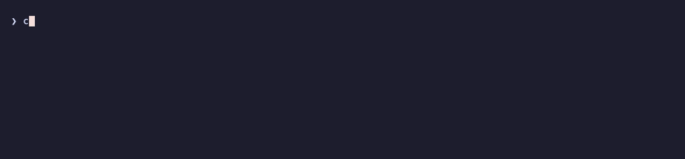

# scriv

[](https://github.com/joakimen/scriv/actions/workflows/ci.yml)
[](https://github.com/joakimen/scriv/releases/latest)
[](#install)
[](LICENSE)


Provides fuzzy-completion for various local and remote resources.

A single fuzzy selector over resources that would otherwise each need their own
command and output parser: Git repositories, tracked files, Markdown notes,
branches, worktrees, GitHub pull requests, system processes and fish history.
Each group lists its set, selects from it, and acts on the selection. `project`
is the exception: it reads the directory you are standing in and builds or
installs it, whatever it turns out to be written in.

The finder is linked into the binary — no `fzf` dependency and no subprocess.
`scriv init fish` emits shell functions, key bindings and completions.



## Install

```sh
curl --proto '=https' --tlsv1.2 -LsSf https://github.com/joakimen/scriv/releases/latest/download/scriv-installer.sh | sh
```

The script installs into `~/.local/bin` and adds it to `PATH`. Alternatively,
through a version manager or from source:

```sh
mise use -g github:joakimen/scriv
cargo install --git https://github.com/joakimen/scriv
```

Supported platform: macOS on Apple Silicon. `scriv ps` depends on Darwin's
signal numbers, and the crate refuses to compile for any other target.

External requirements: `git`, plus `gh` for `pr` and `repo clone`/`open`, `rg`
for `note rg`, `bat` for syntax-highlighted previews, a fish history file for
`history`, `claude` for `stats improve`, and `$VISUAL` or `$EDITOR` for `edit` —
or `[note] editor` for `note`. `scriv config check` reports on each. `project` runs whatever the
project in front of it asks for, and reports a tool the machine does not have as
a skip rather than a failure.

## Setup

```sh
scriv config init          # write ~/.config/scriv/config.toml, then set `root`
scriv init fish | source   # helpers, key bindings, completions
scriv config print         # every setting, and what is in force for it
scriv config check         # confirm it all resolves
```

Add the second line to `~/.config/fish/config.fish` to make it permanent. Key
bindings are emitted as a function rather than bound at source time, so they
compose with fish's binding lifecycle; call it from `fish_user_key_bindings`:

```fish
function fish_user_key_bindings
    scriv_key_bindings
end
```

`config init` writes every setting as a commented line. `repo.root` is the one
that must be set: repositories are located at `<root>/<owner>/<repo>`.

```toml
[repo]
root = "~/dev/github.com"
ignore = ["node_modules", "target"]
# labels = { personal = ["your-github-user"], work = ["acme", "acme-labs"] }

[note]
root = "~/notes"    # an Obsidian vault, or any tree of Markdown files
editor = "nvim"     # what `note` opens one with; unset, $VISUAL / $EDITOR
# scratch = "scratch/scratch.md"   # the one note `note scratch` opens
# labels = { work = ["projects", "clients"], personal = ["journal"] }
```

## Commands

| Group | Verbs |
| --- | --- |
| `scriv repo` | `ls` `sel` `open` `clone` |
| `scriv file` | `ls` `sel` `add` `rm` `prune` |
| `scriv note` | `ls` `sel` `new` `scratch` `edit` `rg` `cleanup` |
| `scriv branch` | `ls` `sel` `checkout` `rm` |
| `scriv worktree` | `ls` `sel` `add` `rm` |
| `scriv pr` | `ls` `sel` `checkout` `open` `merge` |
| `scriv ps` | `ls` `sel` `kill` |
| `scriv history` | `ls` `sel` |
| `scriv edit` | `file` `dir` — found below `$PWD`, opened in `$EDITOR` |
| `scriv project` | `deps` `build` — over `$PWD`, whatever it is written in |
| `scriv config` | `init` `print` `path` `check` |
| `scriv stats` | `show` `reset` `improve` |
| `scriv init` | `fish` and every other shell — see Setup |

A note row is the day it was created and what it calls itself, tinted by the
label its directory carries; everything else about it is in the preview pane.
`note rg` searches inside every note as you type — fuzzily, or exactly on
`ctrl-x` — and turns what you pick into a quickfix list. `note ls` prints
absolute paths, one per line, for piping into whatever reads paths.

Every preview pane shows the file as it is on disk, drawn by `bat` in
`[selector] preview_theme` — Catppuccin Mocha unless you say otherwise.

`scriv project` needs to know nothing about the directory it is in. `deps`
works out which toolchains a project uses from the files in its root — a
`Cargo.toml`, a `package.json` and its lockfile, a `go.mod`, a `pom.xml`, a
`mise.toml`, a `*.tf` — and runs each one's install, `mise` first and the rest
at once. `--dump` reads the same manifests for what they *declare* instead,
grouped by the role each dependency is given. `build` runs the repository's own
`task`, `make` or `just` where it has one, and otherwise builds each toolchain
in turn. The fish integration calls `scriv project deps` `i`.

`scriv stats` counts scriv itself. Every run appends its command and how long it
took to a log — with the time you spent in a selector taken out, so a list left
open over lunch is not a slow command — and `stats show` reads it back as a tree
of every command there is, including the ones you have never run. Nothing but
the command's name is recorded: no arguments, no paths, no what you picked.
`stats improve` hands the busiest commands to Claude Code to work on, and
`stats reset` forgets the lot.

`ls` prints the set, `sel` fuzzy-selects one entry, and the remaining verbs act
on the selection. `sel` prints to stdout and composes: `cd (scriv repo sel)`.
Groups abbreviate to one letter — `r`, `f`, `n`, `b`, `w`, `e`, `h`, `c`, `s` —
with `pj` for `project`; `ps` and `pr` are already two.

## Key bindings

`scriv_key_bindings` binds these in fish, unless you say otherwise:

| Key | Action |
| --- | --- |
| `ctrl-o` | `cd` to a repository |
| `ctrl-t` | `cd` to a worktree of the current repository |
| `ctrl-g` | check out a branch |
| `ctrl-r` | search shell history onto the command line |
| `up` | the same, on the first line of a prompt |
| `f1` | open a repository on GitHub |
| `f2` | open this branch's pull request, or the list if it has none |
| `f3` | open a tracked file in `$EDITOR` |
| `f7` | check out a pull request |
| `f10` | open a note from your vault |

`scriv init fish` also defines `fe` (`scriv edit`), `kl` (`scriv ps kill
--force`), `i` (`scriv project deps`) and `b` (`scriv project build`), each
passing its arguments through.

Both tables are configuration. `[shell.bindings]` maps a key to an action and
`[shell.aliases]` maps a name to one; neither holds shell code, so the same
config serves any shell scriv learns to write for. `config init` writes the
defaults out commented — uncomment a table to own it, since one written here
replaces the defaults rather than adding to them, and leaving a key out is how
it is unbound.

```toml
[shell.aliases]
fe = "edit"
kl = "proc-kill"
i  = "project-deps"
bb = "project-build"   # `b` by default
```

`scriv config print` lists every key and name with the action it runs and what
that action does; `scriv config check` says whether they all resolve. An action
scriv does not define stops `scriv init fish` outright rather than emitting a
shell where one key silently does nothing.

Inside a selector, `ctrl-v` hides and shows the preview pane and `tab` takes
several rows where several are allowed. Anything else a selector answers to is
named in its own header — `f2` and `f7` mean the same in a pull request list as
they do at the prompt, and `f1` does in a repository list.

Flags are documented in `scriv --help`, settings in the generated
`config.toml`.

## Development

```sh
make              # fmt check, clippy, tests, release build
make hooks        # install the git hooks in prek.toml
make demo         # re-record docs/demo.gif
make demo-fixture # build the demo sandbox and poke at it by hand
```

Dependency updates come from [Renovate](https://docs.renovatebot.com),
configured in `.github/renovate.json5`: one grouped pull request a week, merged
on its own once the checks pass and the release is three days old. Crate
majors, the `skim`/`ratatui` pair and `dist` wait for a human instead, and
`.github/workflows/release.yml` is left alone — `dist init` writes that file.

## Releasing

A pushed tag is the release, and merging a pull request is what pushes it.
Nothing is run by hand.

Every push to `main` runs [release-plz](https://release-plz.dev), which keeps a
pull request open proposing the next version: the bump in `Cargo.toml` and
`Cargo.lock`, and the version heading and release date that `## Unreleased`
work in `CHANGELOG.md` is filed under.
Merging that pull request tags the merge commit with that version and pushes
the tag. Leaving it open holds the version, which is the answer to a run of
pull requests that only touched docs, `demo/` or CI.

The proposal is a patch. A change that earns a minor — a new command or flag —
says so with a `Release: minor` line in a commit message on its branch, which
`release-plz.toml` matches. Not the pull request description: squash merges here
take the commit messages and discard it. Should the open pull request read the
wrong version anyway, edit `Cargo.toml` on its branch, run `cargo check` for the
lockfile, fix the `CHANGELOG.md` heading to match, and merge before anything
else lands: the next push to `main` rebuilds that branch from scratch.

The tag starts [dist](https://axodotdev.github.io/cargo-dist), configured in
`dist-workspace.toml`: it refuses a version no package carries, builds
`aarch64-apple-darwin`, writes the install script, and publishes the release
once the tarball, its checksum and its build provenance exist. The release takes
its title and notes from that version's section of `CHANGELOG.md`, so an entry
written under `## Unreleased` while the work was done is what a reader sees.
`.github/workflows/release.yml` is generated — change `dist-workspace.toml` and
run `dist init`, never the workflow.

dist needs no secret, and every pull request runs `dist plan`, which catches a
misconfiguration before a tag exists. release-plz needs one: `RELEASE_PLZ_TOKEN`,
a fine-grained token with `Contents` and `Pull requests` write on this
repository. The workflow's own `GITHUB_TOKEN` cannot stand in — a tag it pushes
starts no workflow, so dist would never build, and a pull request it opens runs
no checks, so `build` and `demo` would never report to the ruleset on `main`.

## License

[MIT](LICENSE)
